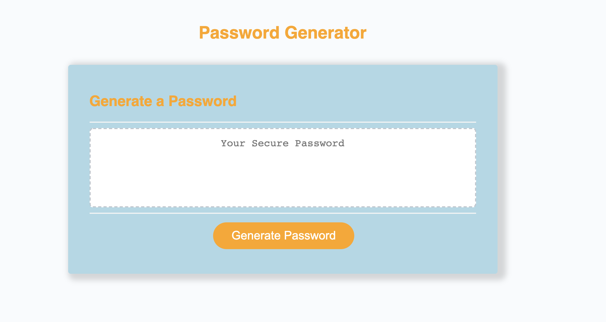
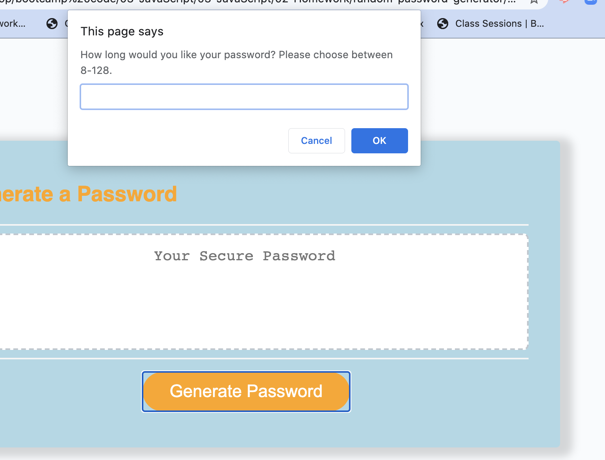
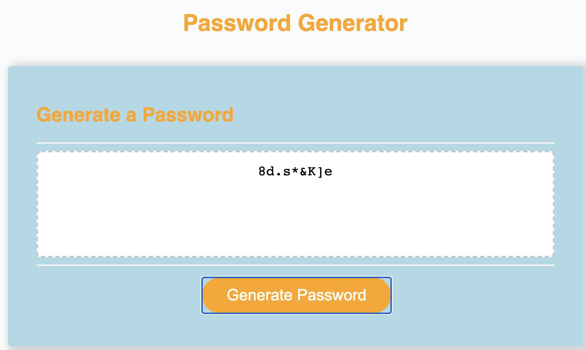

# random-password-generator
Taking starter code and adding JavaScript elements to help users generate a safe and randomized password

# Inside Look
Once inside of the develop folder, you'll see three files. For this assignment I was given starter code for an html, css, and JavaScript. 
The starter code was given to me with no working parts. What I had to do was utilize the skills I have learned through JavaScript and make a working site that generates a secure, randomized, password for the user that visits the site. 

 https://sawi4644.github.io/random-password-generator/.

# Criteria
When you click on the button a random secure password will be given to you. When you are prompted for criteria for your random password you are able to choose which criteria you need to include. 
When the user is asked about length they are restricted between 8 characters and 128.
The user is only able to use lowercase, uppercase,numeric, and/ or special characters. The user is prompted to at least have one of the character options.
When the user answers all prompts then they are able to generate a random password that matches all criteria. 
Once the password is generated for the user then the password will be written on the page.

# Built With
<ul>VS Code - Mac </ul>

# Screen Shots of Deployed Spot

